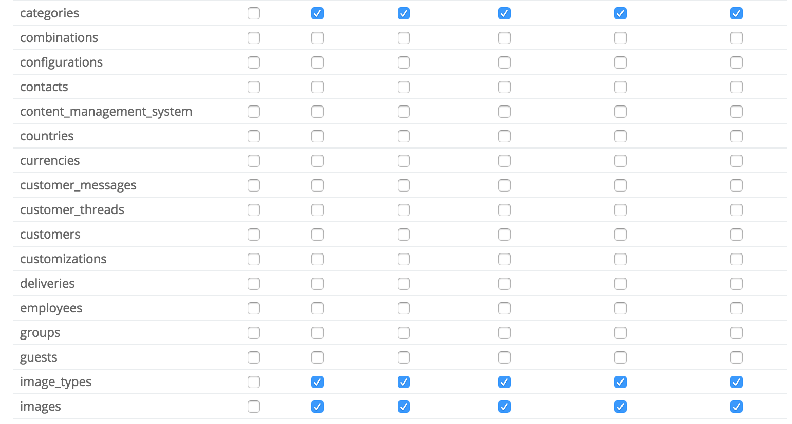
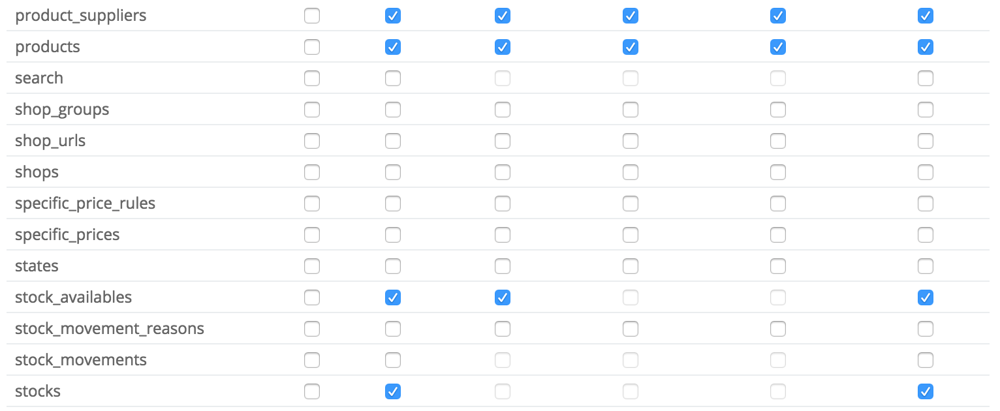

Dans le cadre d'un projet professionnel j'ai eu à communiquer avec l'API/webservice de Prestashop, le but était d'envoyer des produits vers une boutique distante. Je tiens à préciser que le tutorial officiel est très complet, néanmoins les exemples proposés ne concernent pas les produits et j'ai eu quelques problèmes en chemin... Nous allons donc essayer ici d'envoyer un produit de façon la plus complète possible.

## 1) Configuration initiale

Je ne vais pas m'attarder sur la configuration initiale étant plutôt [bien expliquée ici](http://doc.prestashop.com/display/PS16/Web+service+tutorial). Mais pour récapituler nous avons une clé API qui aura les droits sur les produits, les images, les associations produits et les catégories :





Vérifiez que votre API vous est bien ouverte dans votre navigateur web en accédant à l'url de votre site :

```
VOTRECLEAPIAUTORISE@http://www.votreprestashop.com/api/
```

Vous devrez alors voir plusieurs lignes de xml correspondants aux ressources accessibles par votre clé API. Vérifiez que les méthodes GET PUT POST DELETE HEAD sont bien à "true":

```xml
<products xlink:href="http://www.votreprestashop.com/api/products" get="true" put="true" post="true" delete="true" head="true">...</products>
```

#### Problèmes rencontrés :

Si tout va bien et que vous voyez la liste de ressources accessibles tout est OK sinon :

- vérifiez que votre clé API est la bonne est que vous avez bien configuré les **autorisations**.
- vérifiez que **l'URL Rewrite soit bien activé.**
- si vous utilisez Nginx (ou êtes sur **OVH** mutualisé); vérifiez que vous avez les bonnes règles de réécriture d'URL. Vous aurez peut être aussi à rajouter un **.htaccess** au niveau du dossier **/webservice** de votre Prestashop.

```apacheconf
<IfModule mod_rewrite.c>
    RewriteEngine on
    RewriteRule .* – [E=HTTP_AUTHORIZATION:%{HTTP:Authorization},L]
</IfModule>
```

Ensuite dans **webservice/dispatcher.php** ajoutez les lignes suivantes :

```php
if(strpos(@php_sapi_name(), 'CGI')){
    list($_SERVER['PHP_AUTH_USER'], $_SERVER['PHP_AUTH_PW']) =
        explode(':' , base64_decode(substr($_SERVER['HTTP_AUTHORIZATION'], 6)));
};
```

## 2) Communiquer avec le Webservice

C'est parti ! Dans cet exemple nous allons créer un simple fichier php qui va communiquer et envoyer un produit vers le web service.

#### Récupérer la librairie Webservice avec composer.

Je vais utiliser [composer](https://getcomposer.org/) pour initialiser mon application et récupérer le package webservice de Prestashop :

```shell
mkdir learning-ps-webservice
cd learning-ps-webservice
```

Dans mon nouveau dossier j'initialise composer avec la librairie webservice de Prestashop.

```shell
composer init --require="Prestashop/Prestashop-webservice-lib:dev-master" -n
composer install
```

_"-n" permet de dire à composer de ne pas me poser les questions interactives habituelles !_

La librairie n'étant pas aux normes PSR, on doit ajouter le fichier **PSWebServiceLibrary.php** à l'autoload de composer.

A la racine de notre dossier on édite **composer.json**

```json
{
  "require": {
    "Prestashop/Prestashop-webservice-lib": "dev-master"
  },
  "autoload": {
    "files": ["vendor/prestaShop/prestaShop-webservice-lib/PSWebServiceLibrary.php"]
  }
}
```

Ensuite :

```shell
composer dump-autoload
```

#### Préparation du produit à envoyer

On crée la base de notre fichier **index .php** :

```php
require 'vendor/autoload.php';

$url = 'http://votreprestashop.com';
$key  = 'VOTRECLEAPIAUTORISE';
$debug = true;

$webService = new PrestaShopWebservice($url, $key, $debug);
```

##### Au moment de l'écriture de cet article, si vous utilisez Prestashop plus récent que 1.6.1.0

Vous aurez peut être à modifier le fichier **PSWebServiceLibrary.php ligne 49** et remplacez par

```php
const psCompatibleVersionsMax = '1.6.2.0';
```

Passons à la suite ! Dans notre exemple, notre produit sera lié à une catégorie que l'on va créer et il aura un stock défini. Pour pouvoir envoyer ces données, nous devrons créer ces ressources **avant** de créer le produit, ce qui nous oblige à communiquer avec d'autres ressources que api/products...

#### La catégorie

Pour connaitre les données obligatoires d'une ressource il suffit d'ouvrir dans votre navigateur :

```
VOTRECLEAPIAUTORISE@http://votreprestashop.com/api/categories?schema=synopsis
```

Le nom, link_rewrite et catégorie active ou pas, sont nos données obligatoires. Dans **index.php** :

```php
//... index.php
$webService = new PrestaShopWebservice($url, $key, $debug);

try {
    //préparation catégorie à envoyer
    $xml = $webService->get(array('url' => $url.'/api/categories?schema=blank'));

    //récupération node category
    $category = $xml->children()->children();

    $category->name->language[0][0] = "Ma catégorie";
    $category->name->language[0][0]['id'] = 1;
    $category->name->language[0][0]['xlink:href'] = $url . '/api/languages/' . 1;

    $category->link_rewrite->language[0][0] = "ma-categorie";
    $category->link_rewrite->language[0][0]['id'] = 1;
    $category->link_rewrite->language[0][0]['xlink:href'] = $url . '/api/languages/' . 1;

    $category->id_parent = 2; //Accueil
    $category->active = 1;

    //Envoie des données
    $opt = array('resource' => 'categories');
    $opt['postXml'] = $xml->asXML();
    $xml = $webService->add($opt);

    //on récupère l'id de la nouvelle catégorie insérée
    $ps_category_id = $xml->category->id;

}
catch (PrestaShopWebserviceException $e) {
    $trace = $e->getTrace();
    if ($trace[0]['args'][0] == 404) echo 'Bad ID';
    else if ($trace[0]['args'][0] == 401) echo 'Bad auth key';
    else echo $e->getMessage();
}
```

Notez bien que l'on récupère l'**id de la catégorie insérée** car on en aura besoin...

#### Le produit

On va suivre le même principe pour l'ajout du produit, néanmoins la gestion du stock et de l'image se feront **après**, car ils demandent d'avoir un id produit **déjà existant**. Maintenant que la catégorie est ajoutée, on repart dans **index.php** :

```php
// ... index.php
$ps_category_id = $xml->category->id;

/** Produit */
$xml = $webService->get(array('url' => $url.'/api/products?schema=blank'));

$product = $xml->children()->children();

$product->price = 99; //Prix TTC
$product->wholesale_price = 89; //Prix d'achat
$product->active = '1';
$product->on_sale = 0; //on ne veux pas de bandeau promo
$product->show_price = 1;
$product->available_for_order = 1;

$product->name->language[0][0] = "Produit webservice";
$product->name->language[0][0]['id'] = 1;
$product->name->language[0][0]['xlink:href'] = $url . '/api/languages/' . 1;

$product->description->language[0][0] = "Description produit webservice";
$product->description->language[0][0]['id'] = 1;
$product->description->language[0][0]['xlink:href'] = $url . '/api/languages/' . 1;

$product->description_short->language[0][0] = "Descr. courte";
$product->description_short->language[0][0]['id'] = 1;
$product->description_short->language[0][0]['xlink:href'] = $url . '/api/languages/' . 1;
$product->reference = "ref_product_webservice";
//On va gérer le stock ensuite
$product->depends_on_stock = 0;
//Association avec notre catégorie créée auparavant
$product->associations->categories->addChild('category')->addChild('id', $ps_category_id);
$product->id_category_default = $ps_category_id;

//envoi du produit
$opt = array('resource' => 'products');
$opt['postXml'] = $xml->asXML();
$xml = $this->web_service->add($opt);

//on récupère l'id du produit inséré
$ps_product_id = $xml->product->id;
// ...
```

Et voila, notre produit a bien été ajouté !


On peut voir que la quantité est à 0 mais maintenant que nous avons l'id produit nous pouvons interagir avec les ressources de stock !

Rendez-vous dans la **[partie 2](/blog/webservice-prestashop-1-6-partie-2-ajout-stock-et-image-du-produit/)** pour **ajout du stock et de l'image** !
